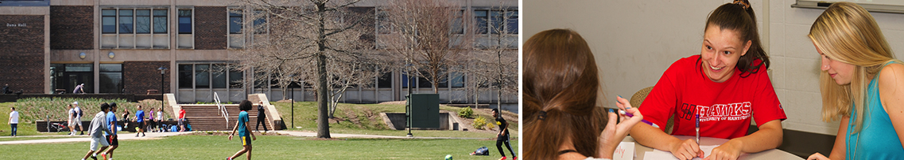

## Stats Trial Fall 2018 

<!-- Want a banner image? Find the image you want and store it in the images directory with the name `banner.jpg`. (Or you can modify the file name in the next line, with any image URL you want. -->

{img:height="300px" width="100%"}
<!-- If you don't want a banner, delete the previous line.  -->

## Welcome

- My name is Natalie Svyeshnikova
- Office Hours: TBA
- Textbook: TBA


## Daily schedule: Fall 2018

### Friday Sept 7

* Topic: Welcome to Stats 1342
* Lesson: [What is stats?](https://dtkaplan.shinyapps.io/Lesson_first_day_births/)
* Reading: Textbook Chap 1, pp. 14-19


### Monday Sept 10

* Topic: Data into graphics
* Reading: Textbook Chap 1, pp. 20-25
* Practice: Using the [introductory Little App](https://dtkaplan.shinyapps.io/littleapp-t-statistic/)

### Wednesday Sept 12

* Topic: Data frames
* Reading: Textbook Chap 1, pp 26-32
* In-class activity: Who are you?
    - [The spreadsheet for collaborative editing](https://docs.google.com/spreadsheets/d/1Lp7_FfLune36fmULuGqU1HMI4o-wiRIpSdjIijj0EbQ/edit?usp=sharing) 
    - Command for reading data into R: 
    ```r
Class_data <- gs_read(gs_key("1ucevNh7wKLtOukyEpacUKi5_-KZUQGtIOONhWRnnnQ4"))
```

### Friday Sept 14

* You get it at this point.
* You can put whatever you want for each day:
    - topic, reading, homework due, StatPREP tutorials or apps, links to a data-entry page, ...
